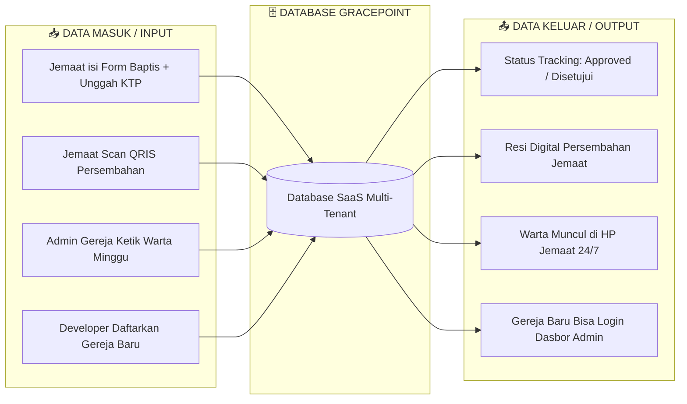

# 🗄️ Panduan & Arsitektur Lengkap Database GracePoint CMS

Dokumen ini dirancang khusus agar **mudah dipahami secara teknis maupun konseptual**, menjelaskan kerangka database, tabel, field, tipe data, contoh isi data nyata (*record*), serta alur **Data Masuk (Input)** dan **Data Keluar (Output)** untuk 3 Aktor Utama.

---

## 🎭 1. Penjelasan Masing-Masing dari 3 Aktor Utama

### A. 👨‍💻 Admin Utama (Programmer & Developer)
* **Siapa Mereka?**: Tim pengembang platform GracePoint (Anda dan tim pengembang).
* **Fungsi Utama**: Mengelola seluruh infrastruktur aplikasi, menambah gereja baru yang berlangganan, melihat log error server, serta mengelola master data sinode.
* **Apa yang Di-Input (Masuk)?**:
  * Pendaftaran gereja baru yang ingin bergabung ke platform.
  * Pengaturan batas kuota jemaat & fitur paket langganan.
  * Master data Sinode (misal: HKBP, GBI, GSJA, GMIM, GPdI).
* **Apa yang Dilihat/Diterima (Output)?**:
  * Dasbor analisis total gereja aktif & total jemaat di seluruh Indonesia.
  * Audit Log (catatan aktivitas siapa yang melakukan perubahan data/error di sistem).

---

### B. ⛪ Admin Gereja (Pengurus / Sekretariat Gereja)
* **Siapa Mereka?**: Sekretaris gereja, tata usaha, bendahara, atau pendeta lokal di gereja tertentu.
* **Fungsi Utama**: Mengelola operasional harian gereja tempat mereka bertugas (hanya dapat melihat data gereja mereka sendiri).
* **Apa yang Di-Input (Masuk)?**:
  * Menerbitkan Warta Jemaat mingguan & Jadwal Ibadah.
  * Mengomfirmasi & memverifikasi berkas pendaftaran Sakramen (Baptis/Nikah) yang dikirim jemaat.
  * Memvalidasi laporan persembahan masuk & statistik kehadiran.
* **Apa yang Dilihat/Diterima (Output)?**:
  * Notifikasi pendaftaran sakramen baru dari jemaat.
  * Laporan rekapitulasi persembahan mingguan & bulanan.
  * Daftar seluruh jemaat terdaftar di gerejanya.

---

### C. 👤 User (Jemaat Gereja)
* **Siapa Mereka?**: Anggota jemaat gereja yang menggunakan aplikasi dari ponsel/laptop.
* **Fungsi Utama**: Mengakses layanan gereja secara digital & mandiri (*self-service*).
* **Apa yang Di-Input (Masuk)?**:
  * Mengisi/mengubah data profil keluarga (nomor HP, alamat, pekerjaan).
  * Mengajukan pendaftaran Baptis/Nikah & mengunggah foto KTP/KK.
  * Melakukan pembayaran persembahan via QRIS / Bank.
  * Mengirimkan pokok doa privat & pendaftaran konseling.
* **Apa yang Dilihat/Diterima (Output)?**:
  * Pelacakan status berkas (*Status Tracking*: `Terkirim` ➔ `Diverifikasi` ➔ `Disetujui`).
  * Membaca Warta Jemaat digital & jadwal ibadah minggu ini.
  * Resi/bukti catatan persembahan pribadi yang tersimpan privat.

---

## 🔄 2. Alur Data Masuk (Input) & Data Keluar (Output) Per Modul

---

## 🗂️ 3. Rincian Kerangka Tabel, Field, & Contoh Record Data

---

### 📦 MODUL 1: Sistem Multi-Tenant & Developer (Admin Utama)

#### 1. Tabel `sinodes_partners` (Master Data Sinode)
> **Fungsi**: Menyimpan daftar sinode/denominasi gereja di Indonesia.

| Nama Field | Tipe Data | Keterangan | Contoh Isi Data Real |
| :--- | :--- | :--- | :--- |
| `id` | BIGINT (PK) | Kunci Unik Sinode | `1` |
| `name` | VARCHAR(150) | Nama Sinode | `"Gereja Kristen Protestan Mentawai"` |
| `abbreviation`| VARCHAR(20) | Singkatan | `"GKPM"` |
| `headquarter` | VARCHAR(100) | Kota Pusat Sinode | `"Mentawai, Sumatera Barat"` |
| `status` | ENUM | Status Kemitraan | `'ACTIVE'` |

#### 2. Tabel `tenants_churches` (Daftar Gereja Terdaftar)
> **Fungsi**: Memisahkan data antar-gereja (Multi-Tenant).

| Nama Field | Tipe Data | Keterangan | Contoh Isi Data Real |
| :--- | :--- | :--- | :--- |
| `id` | BIGINT (PK) | ID Gereja (`church_id`) | `101` |
| `sinode_id` | BIGINT (FK) | Relasi ke `sinodes_partners` | `1` |
| `church_code` | VARCHAR(30) | Kode Unik Gereja | `"GKPM-TUAPEJAT"` |
| `church_name` | VARCHAR(200) | Nama Gereja | `"GKPM Jemaat Tuapejat"` |
| `address` | TEXT | Alamat Lengkap | `"Jl. Raya Tuapejat Km. 4, Mentawai"` |
| `phone` | VARCHAR(30) | No Telp Sekretariat | `"0759-32011"` |
| `email` | VARCHAR(100) | Email Resmi | `"tuapejat@gkpm.org"` |
| `status` | ENUM | Status Berlangganan | `'ACTIVE'` |

---

### 👥 MODUL 2: Akun Pengguna & Profil Jemaat (3 Aktor)

#### 3. Tabel `users` (Akun Login System)
> **Fungsi**: Menyimpan data akun login untuk ketiga aktor (Developer, Admin Gereja, dan Jemaat).

| Nama Field | Tipe Data | Keterangan | Contoh Isi Data Real |
| :--- | :--- | :--- | :--- |
| `id` | BIGINT (PK) | ID Akun | `301` |
| `church_id` | BIGINT (FK) | Gereja Asal (NULL jika Dev) | `101` |
| `email` | VARCHAR(120) | Email Login | `"yohanes.mentawai@gmail.com"` |
| `password_hash` | VARCHAR(255) | Password Terenkripsi | `"$2a$12$eImiTXuWVmM..."` |
| `full_name` | VARCHAR(150) | Nama Lengkap | `"Yohanes Saogo"` |
| `phone` | VARCHAR(25) | No WhatsApp | `"081267891122"` |
| `role` | ENUM | Peran Aktor | `'JEMAAT'` *(Opsi: 'SUPER_ADMIN', 'CHURCH_ADMIN', 'JEMAAT')* |
| `status` | ENUM | Status Akun | `'ACTIVE'` |

#### 4. Tabel `jemaat_profiles` (Biodata Jemaat Lengkap)
> **Fungsi**: Data detail jemaat yang diisi oleh Jemaat sendiri / Admin Gereja.

| Nama Field | Tipe Data | Keterangan | Contoh Isi Data Real |
| :--- | :--- | :--- | :--- |
| `id` | BIGINT (PK) | ID Profil | `501` |
| `user_id` | BIGINT (FK) | Relasi ke `users.id` | `301` |
| `church_id` | BIGINT (FK) | Relasi ke `tenants_churches` | `101` |
| `no_induk` | VARCHAR(50) | Nomor Induk Jemaat (NIJ) | `"GKPM-2024-0012"` |
| `nik` | VARCHAR(20) | NIK KTP | `"1309012205950001"` |
| `gender` | ENUM | Jenis Kelamin | `'L'` |
| `birth_date` | DATE | Tanggal Lahir | `"1995-05-22"` |
| `marital_status`| ENUM | Status Pernikahan | `'SINGLE'` |
| `occupation` | VARCHAR(100) | Pekerjaan | `"Wiraswasta"` |

---

### 📰 MODUL 3: Warta & Jadwal Ibadah (Admin Gereja ➔ Jemaat)

#### 5. Tabel `warta_jemaat` (Warta Jemaat Digital)
> **Input (Masuk)**: Admin Gereja mengetik warta / upload buletin.  
> **Output (Keluar)**: Jemaat membaca di aplikasi dari HP.

| Nama Field | Tipe Data | Keterangan | Contoh Isi Data Real |
| :--- | :--- | :--- | :--- |
| `id` | BIGINT (PK) | ID Warta | `701` |
| `church_id` | BIGINT (FK) | Gereja Penerbit | `101` |
| `edition_date` | DATE | Tanggal Minggu | `"2026-07-26"` |
| `title` | VARCHAR(200) | Judul Warta | `"Warta Jemaat Minggu VI Setelah Trinitatis"` |
| `sermon_summary`| TEXT | Ringkasan Khotbah | `"Hidup Saling Melayani dalam Kasih Kristus (Yohanes 15:12)"` |
| `announcements` | LONGTEXT | Isi Pengumuman | `"1. Pembaptisan Kudus dilaksanakan tgl 15 Agustus. 2. Pendaftaran Komsel dibuka."` |
| `status` | ENUM | Status Publikasi | `'PUBLISHED'` |

#### 6. Tabel `events_schedule` (Jadwal Ibadah & Pelayan)

| Nama Field | Tipe Data | Keterangan | Contoh Isi Data Real |
| :--- | :--- | :--- | :--- |
| `id` | BIGINT (PK) | ID Jadwal | `801` |
| `church_id` | BIGINT (FK) | Gereja | `101` |
| `title` | VARCHAR(150) | Nama Ibadah | `"Ibadah Raya Minggu Sesi I"` |
| `start_time` | DATETIME | Mulai | `"2026-07-26 08:00:00"` |
| `end_time` | DATETIME | Selesai | `"2026-07-26 10:00:00"` |
| `speaker_name` | VARCHAR(150) | Pengkhotbah | `"Pdt. Markus Samaloisa, S.Th"` |
| `location` | VARCHAR(150) | Lokasi | `"Gedung Utama GKPM Tuapejat"` |

---

### 🕊️ MODUL 4: Sakramen & Layanan Mandiri (Jemaat ➔ Admin Gereja)

#### 7. Tabel `sacrament_applications` (Pendaftaran Sakramen Digital)
> **Input (Masuk)**: Jemaat memilih jenis sakramen & mengisi formulir di aplikasi.  
> **Output (Keluar)**: Admin Gereja melihat pendaftaran masuk & Jemaat bisa cek status (*tracking*).

| Nama Field | Tipe Data | Keterangan | Contoh Isi Data Real |
| :--- | :--- | :--- | :--- |
| `id` | BIGINT (PK) | ID Permohonan | `1001` |
| `church_id` | BIGINT (FK) | Gereja Tujuan | `101` |
| `jemaat_id` | BIGINT (FK) | Jemaat Pemohon | `301` |
| `sacrament_type`| ENUM | Jenis Sakramen | `'BAPTISM'` *(Opsi: BAPTISM, MARRIAGE, SIDI, CHILD_DEDICATION)* |
| `tracking_code` | VARCHAR(50) | Kode Unik Tracking | `"BAPTIS-202607-009"` |
| `status` | ENUM | Status Berkas | `'VERIFYING'` *(Opsi: SUBMITTED, VERIFYING, APPROVED, REJECTED)* |
| `scheduled_date`| DATETIME | Jadwal Pelaksanaan | `"2026-08-15 09:00:00"` |
| `notes` | TEXT | Catatan Admin | `"Berkas KTP & KK lengkap. Wawancara tgl 5 Agustus."` |

#### 8. Tabel `sacrament_documents` (Berkas Syarat Upload)

| Nama Field | Tipe Data | Keterangan | Contoh Isi Data Real |
| :--- | :--- | :--- | :--- |
| `id` | BIGINT (PK) | ID Berkas | `1201` |
| `application_id`| BIGINT (FK) | Relasi Permohonan | `1001` |
| `doc_type` | VARCHAR(50) | Jenis Dokumen | `"KTP_PEMOHON"` |
| `file_path` | VARCHAR(255) | Lokasi File | `"/uploads/docs/ktp_yohanes_1001.pdf"` |
| `is_verified` | BOOLEAN | Status Verifikasi | `true` |

---

### 💳 MODUL 5: Keuangan & Persembahan Digital (Jemaat ➔ Admin Gereja)

#### 9. Tabel `financial_transactions` (Persembahan Digital)
> **Input (Masuk)**: Jemaat transfer persembahan via QRIS / Bank.  
> **Output (Keluar)**: Resi digital untuk Jemaat & Laporan Keuangan untuk Admin Gereja.

| Nama Field | Tipe Data | Keterangan | Contoh Isi Data Real |
| :--- | :--- | :--- | :--- |
| `id` | BIGINT (PK) | ID Transaksi | `9001` |
| `church_id` | BIGINT (FK) | Gereja Penerima | `101` |
| `jemaat_id` | BIGINT (FK) | Jemaat Pembayar | `301` |
| `trx_code` | VARCHAR(50) | Kode Transaksi | `"TRX-QRIS-20260726-8812"` |
| `category` | ENUM | Jenis Persembahan | `'PERPULUHAN'` *(Opsi: PERSEMBAHAN_MINGGU, PERPULUHAN, DONASI)* |
| `amount` | DECIMAL(15,2)| Nominal (Rp) | `500000.00` |
| `payment_method`| ENUM | Cara Bayar | `'QRIS'` |
| `status` | ENUM | Status Pembayaran | `'SUCCESS'` |
| `receipt_url` | VARCHAR(255) | Resi Pembayaran | `"/receipts/trx_9001.pdf"` |

---

### 🙏 MODUL 6: Pokok Doa & Konseling 24/7 (Jemaat ➔ Admin Gereja)

#### 10. Tabel `prayer_requests` (Permohonan Pokok Doa)

| Nama Field | Tipe Data | Keterangan | Contoh Isi Data Real |
| :--- | :--- | :--- | :--- |
| `id` | BIGINT (PK) | ID Doa | `4001` |
| `church_id` | BIGINT (FK) | Gereja | `101` |
| `jemaat_id` | BIGINT (FK) | Jemaat Pemohon | `301` |
| `title` | VARCHAR(150) | Judul Doa | `"Mohon Doa Kesembuhan Orang Tua"` |
| `content` | TEXT | Isi Pokok Doa | `"Ayah saya sedang dirawat di RS. Mohon bantuan doa dari tim pendoa."` |
| `is_confidential`| BOOLEAN | Rahasia (Hanya Pendeta)| `true` |
| `status` | ENUM | Status Penanganan | `'PRAYED'` *(Opsi: SUBMITTED, PRAYED, CONTACTED)* |
| `pastoral_notes`| TEXT | Tanggapan Pendeta | `"Tim pendoa telah mendoakan Ayah Bapak Yohanes. Tuhan memberkati."` |

---

## 🎯 4. Ringkasan Tanya Jawab Konseptual

1. **Bagaimana data dikelompokkan agar gereja A tidak bisa melihat data gereja B?**
   * Setiap tabel operasional (jemaat, sakramen, keuangan, warta) wajib memiliki kolom `church_id`. Sistem backend akan menyaring data secara otomatis berdasarkan `church_id` admin gereja yang sedang login.

2. **Bagaimana dengan Admin Utama (Developer)?**
   * Admin Utama memiliki `role = 'SUPER_ADMIN'` dan `church_id = NULL`. Mereka dapat melihat dasbor global seperti jumlah total gereja terdaftar, status server, dan audit log.

3. **Mengapa sakramen butuh 2 tabel (`sacrament_applications` & `sacrament_documents`)?**
   * Agar 1 pendaftaran (misal Pembaptisan) bisa menampung banyak file persyaratan sekaligus (KTP, KK, Akta Lahir, Foto 3x4) tanpa membuat tabel menjadi berantakan.
